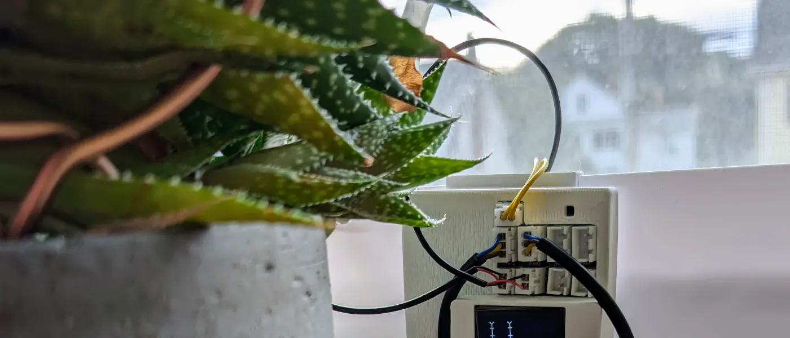
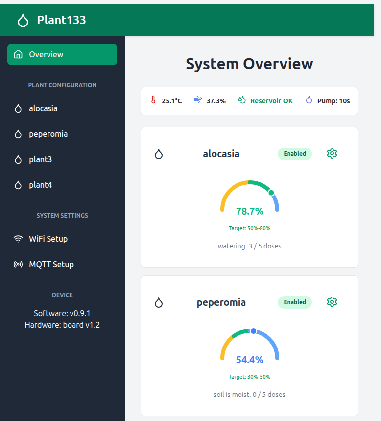
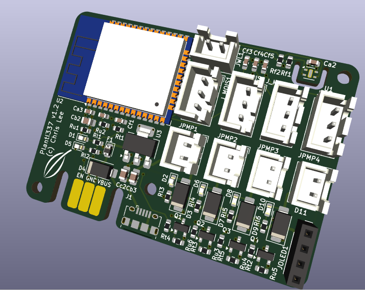
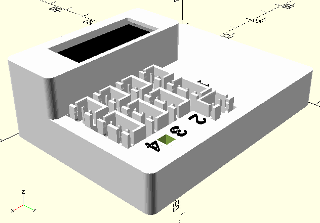
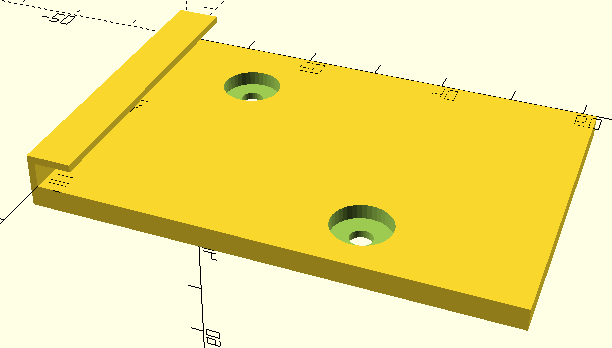
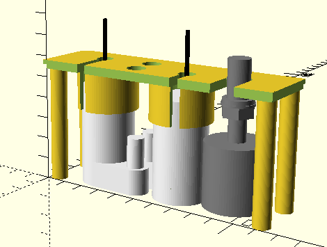
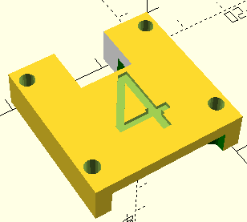
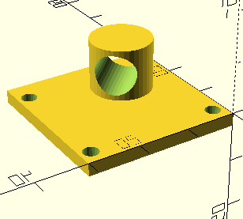
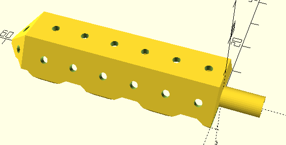
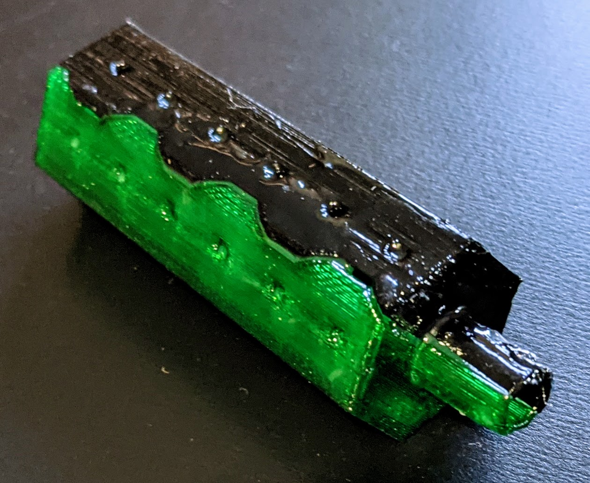

# Plant133

This is a full distribution of the Plant133 plant-watering device.  This device can monitor and water up to 4 plants at a time.  This repository hosts the firmware, PCBA design, and OpenSCAD code for the all components.

A writeup about this project is at "[Plant1337: "Water 4 plants](https://selectiveappeal.org/posts/plant1337/)."

## Setup

Please see the [instructions](instructions.md) for how to setup a Plant133 device if you are lucky enough to have one.

## Software

This project is built using my C++ framework for ESP devices.
- [og3](https://github.com/chl33/og3) My application framework.
- [og3x-oled](https://github.com/chl33/og3x-oled) Support for the OLED screen I use with this project
- [og3x-shtc3](https://github.com/chl33/og3x-shtc3) Support for the SHTC3 temperature/humidty sensor used by this project.

The web interface for the project uses the Svelte framework, and was partially generated by Claude (Anthropic). Claude said it was OK to include the code in this MIT-licensed project. The web interface integration is performed using [svelteesp32](https://github.com/BCsabaEngine/svelteesp32).

## PCBA

The full [KiCAD](https://www.kicad.org/) project for the printed circuit board is in the [KiCAD](KiCAD/) subdirectory.  KiCAD is a cross platform, open source electronics design system.

## Components which can be printed with a 3D printer

Several components for the Plant133 device are printed with a 3D printer. These are designed as 3D geometry descriptions in [OpenSCAD](https://openscad.org/).  The code for these are in the [scad](scad/) subdirectory.

### Project box

OpenSCAD code for the project box housing the PCBA is in the [scad/box/](scad/box/) subdirectory.  It requires the library at https://github.com/chl33/ProjectBox.

### Project box reservoir hanger

Code for a plate which allows you to hang the EBox on the side of a water reservoir is in [scad/ebox_hook](scad/ebox_hook). This is screwed to the bottom part of the EBox.

### Reservoir insert

Inside the water reservoir, an insert holds a float for detecting the water level and 1-4 aquarium pumps for watering the plants.  The code for this insert is in [scad/reservoir_insert](scad/reservoir_insert).

### Moisture sensor cap

A cap for the moisture sensor can hold the end of the watering tube in place in the plant's pot, for when the watering spike is not used.

### Watering spike

The end of the watering tube can be inserted into a 3D-printed spike with holes in it, which can be inserted into the soil in the plant pot to spread water through the pot.

The spike is printed in two halves which can be epoxied together.

