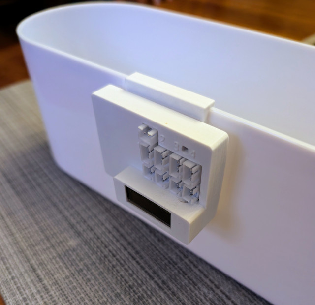
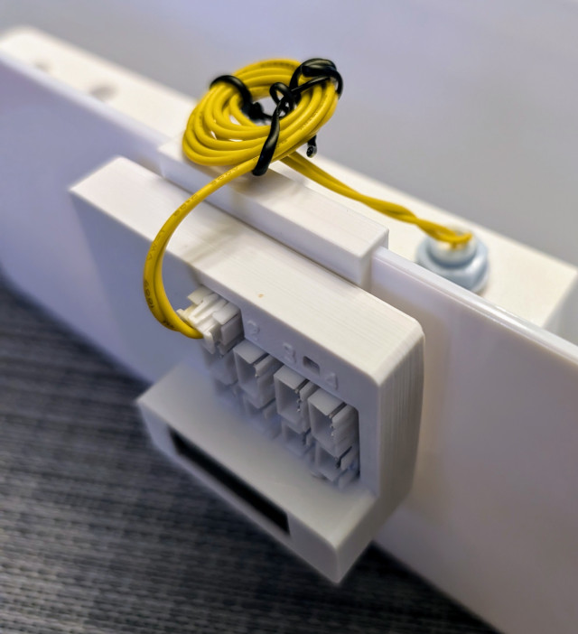
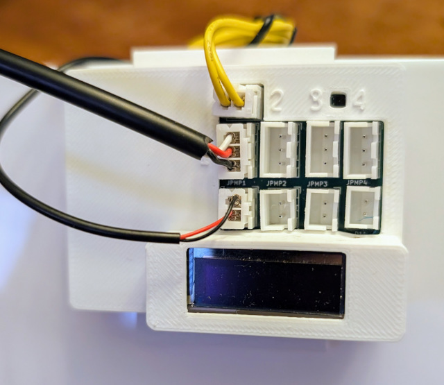
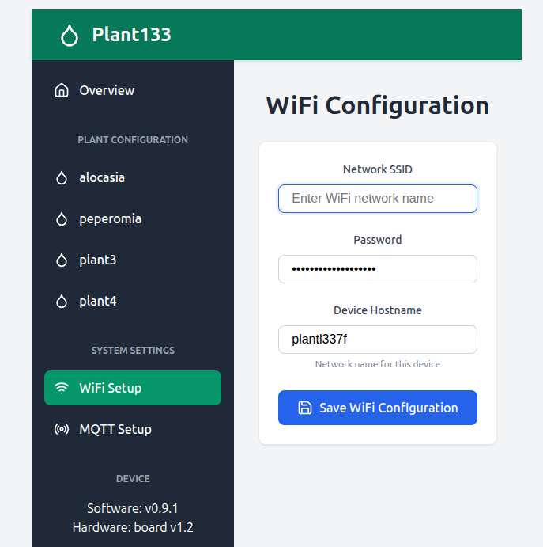
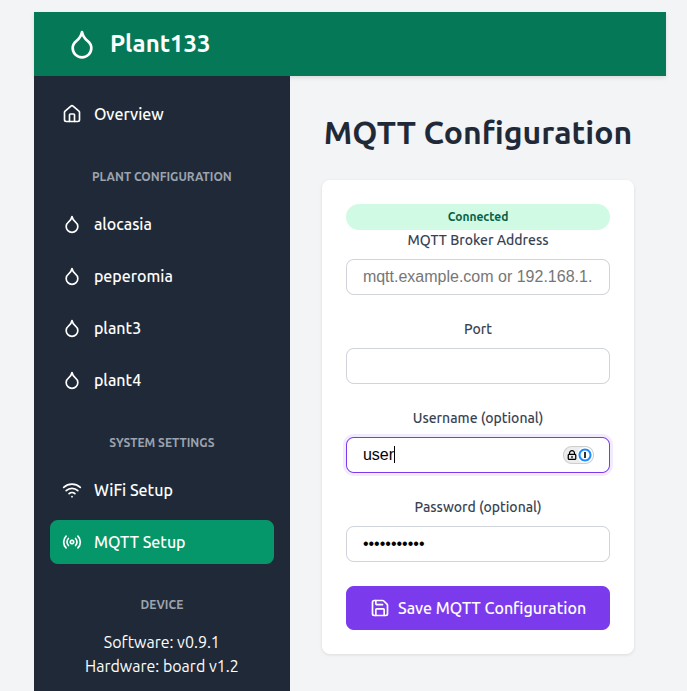

# Plant133 Setup Instructions

Follow this guide to assemble and configure your Plant133 watering system.

## 1. Hardware Assembly

### Mounting the Control Box
Hang the EBox on the side of your water reservoir. Place your plant and reservoir in their final location, ensuring access to a USB power source.

### Reservoir Setup

1.  **Install the Water Level Float**:
    Place the float into the reservoir insert.
    

    Wire the float to the EBox.
    

2.  **Install the Pump**:
    For each plant you intend to water, place a pump into the reservoir insert.
    

### Wiring and Tubing

For each plant,

3.  **Connect Sensors and Pumps**:
    Connect the soil moisture sensor and the corresponding pump to the EBox. Ensure connectors are aligned vertically under the same number (1-4).
    *   The soil moisture sensor uses a 3-conductor wire with JST connectors.
    

4.  **Run Tubing**:
    Run a tube from the pump, through the hole in the insert, towards the plant pot.
    

5.  **Position Water Outlet**:
    Cut the tube to the appropriate length and choose one of the following methods:
    *   **Method A (Cap)**: Push the tube end through the hole in the moisture sensor cap.
        
    *   **Method B (Spike)**: Insert the tube into a 3D-printed soil spike and insert the spike into the soil.
        
        

6.  **Power Up**:
    Connect the EBox to power using a Micro-USB cable.

## 2. Network Configuration

1.  **Connect to Device AP**:
    Look for a WiFi network named `plant133` (or similar) on your phone or computer. Connect to it.
    *   *Note: The AP password (if set) and specific ESSID may be displayed on the device's OLED screen.*

2.  **Access Configuration Page**:
    Open a web browser and navigate to `http://192.168.4.1`. You may need to accept a warning about a non-encrypted connection.

3.  **Configure WiFi**:
    *   Click **"WiFi Setup"** on the main page.
    *   Enter your home WiFi credentials.
    *   Click **"Save"**, then **"Back"**, and finally **"Restart"** to reboot the device.
    

4.  **Reconnect**:
    Connect your phone/computer back to your home WiFi network. Look at the device's OLED screen to find its new IP address (e.g., `192.168.1.x`) or try accessing `http://plant133.local` (if mDNS is active).

## 3. Device Configuration

### MQTT Setup (Optional)
If you use Home Assistant or another home automation system:
1.  Navigate to the **MQTT Setup** page via the web interface.
2.  Enter your Broker address, port, and credentials.
3.  Save. The device should automatically appear in Home Assistant if discovery is enabled.
    

### Plant Configuration
Select a plant from the main menu and click the settings icon.

*   **Moisture Targets**: Set the **Minimum** (start watering) and **Maximum** (stop watering) soil moisture percentages.
*   **Dose Duration**: Set how long the pump runs per dose (in milliseconds).
    *   *Recommendation:* Start with 1000ms (1s) for small pots, 3000ms (3s) for medium pots.
*   **Calibration**:
    *   **Wet (100%)**: Submerge the sensor (excluding the electronic cap) in a glass of water. Note the "Raw Moisture" ADC value and enter it as `ADC Counts at 100%`.
    *   **Dry (0%)**: Dry the sensor completely. Enter the reading as `ADC Counts at 0%`.
    *   *Note: Lower ADC values usually mean higher moisture (more conductivity).*
*   **Dosing Logic**:
    *   **Seconds between doses**: Time to wait for water to soak in before checking moisture again (Default: 900s / 15 min).
    *   **Max doses per cycle**: Safety limit to prevent flooding if the sensor fails (Default: 5).
    

## 4. Final Steps

1.  **Enable System**: In the configuration page, toggle **"Enable Automatic Watering"**.
2.  **Enable Reservoir Check**: Ideally, enable the reservoir water level detection to protect your pumps.
3.  **Fill Reservoir**: Add water to your reservoir.
4.  **Monitor**: Watch the system for the first few cycles and adjust `Pump On Time` or moisture thresholds as needed.

### Advanced
*   **Grafana**: Set up a dashboard to visualize moisture trends over time.
*   **Home Assistant**: Create automations to alert you when the reservoir is low.
