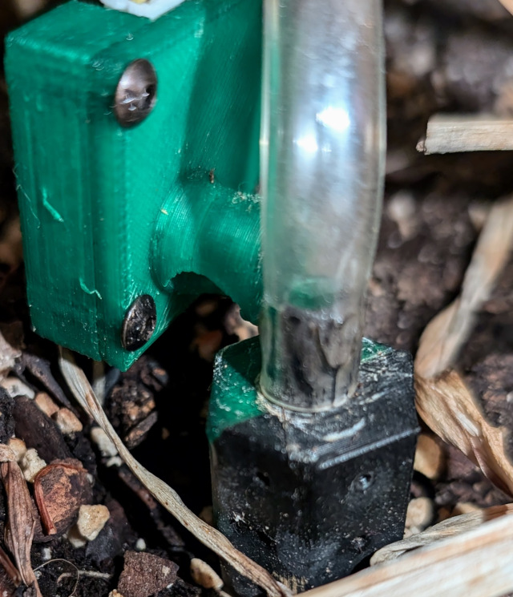

# Instructions

First, hang the EBox on the reservoir and position the plant and reservoir where you want them and in a place where you can power the device with the USB cable.

Then, for each plant to be watered:

1. Install the float in the reservoir insert.

2. Put a pump in the reservoir insert.

3. Connect a soil moisture sensor and pump to the EBox. The connectors should be in a vertical line under 1, 2, 3, or 4 on the EBox. The soil moisture sensor uses a 3-conductor wire with JST connectors.
4. Run a tube from the pump, through the hole in the insert, and then to the soil in the pot.

5. Cut the tube to the right length, and either:
    - Push the end through the hole in the moisture sensor cap to position it for watering the soil, or

      

    - Insert the end of the tube into a soil spike and then insert the soil spike into the soil.

	  
	  
6. Power the EBox with the USB micro cable.
7. Look for the name of the device, and connect your phone or computer to a WiFi network with that name.
8. Open a web browser to http://192.168.4.1, and accept the non-encrypted connection.
9. Use the web interface to configure the device to connect to your home's WiFi network.
10. Look for the IP address of the device on its screen to open its web interface again.  If mDNS works in your home, you might be able to connect to it as "http://{device-name}.local" where "{device-name}" is replaced with the name of your device.
11. If you have an MQTT broker in your house, use the web interface to configure the connection to the broker.  If you are running Home Assistant and it works with your MQTT broker, the device will automatically show up in Home Assistant.
12. In the device web interface, select the plant to be configured.  Select the minimum and maximum soil moisture levels you want, and select the number of seconds you want the pump to run at each iteration of watering.  Try 1 second for a small pot and 3 seconds for a medium-sized pot.
13. Enable watering, and enable reservoir water detection.
14. Fill the reservoir with water.
15. Monitor the plant-watering and tweak settings so it works the way you want it to.
16. You get bonus points for setting up Grafana and creating a dashboard to show how well the watering is working.
17. You can even more bonus points for using Home Assistant to send you a phone alert you when the reservoir is out of water.
